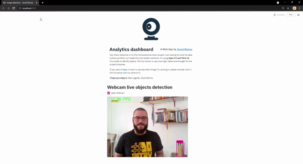

# computational_vision
Hey there! Welcome to my first Computational vision project. I am looking for build my data science portfolio, so I made this with studie intentions. I'm using **Open CV and YOLO v4** tiny model to identify objects. The tiny version is way more light, faster and enought for this project propurse. If you want to keep in touch or just see other things I'm working in, just text me. :)
**I hope you enjoy it.** Best regards, Jeová Ramos.

